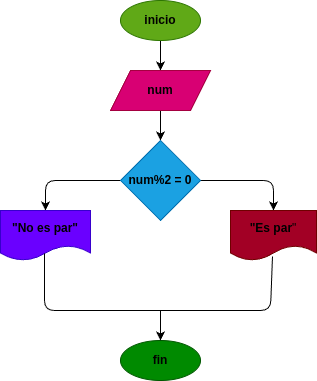

# Par_Impar

programa para verificar si un numero es par o impar

# input
### Processing
si n: n % 2 = 0 se determina que es par

si n: % 2 = 1 se dertermina que es impar

### Output
restuesta
# Diseño

# Construccion

